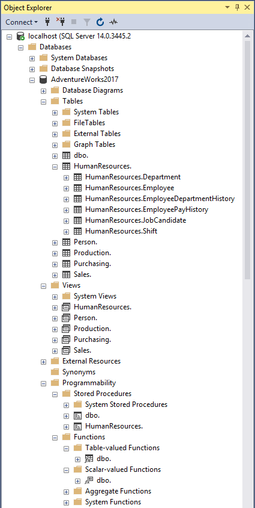

# [SSMS Schema Folders](https://github.com/nicholas-ross/SSMS-Schema-Folders)

This an extension for SQL Server Management Studio 2012, 2014, 2016, 17, 18, 19 and 20.
It groups sql objects in Object Explorer (tables, views, etc.) into schema folders.

Source code, documentation and issues can be found at <https://github.com/nicholas-ross/SSMS-Schema-Folders>

This is a fork of [SSMS2012Extender](https://github.com/NotExperiencedDev/SSMSExtension) (from when it was on CodePlex) that adds support for SSMS 2014 and 2016.

You can download the latest version of SSMS for free from [Microsoft](https://learn.microsoft.com/en-us/sql/ssms/download-sql-server-management-studio-ssms).

## Install

[Download the latest release from the releases page.](https://github.com/nicholas-ross/SSMS-Schema-Folders/releases)

You must unblock the zip file before extracting. Right click on the zip file in Windows Explorer and select Properties. 
If you see an `Unblock` button or checkbox then click it. 

Extract the zip file and copy the `SSMS Schema Folders` folder into the SSMS extension folder. Remove or replace any previous version. For 2012-17 run the included reg file to skip the load error or click `No` when you do see the error and then restart SSMS.

* 2012 - `C:\Program Files (x86)\Microsoft SQL Server\110\Tools\Binn\ManagementStudio\Extensions`
* 2014 - `C:\Program Files (x86)\Microsoft SQL Server\120\Tools\Binn\ManagementStudio\Extensions`
* 2016 - `C:\Program Files (x86)\Microsoft SQL Server\130\Tools\Binn\ManagementStudio\Extensions`
* 17 - `C:\Program Files (x86)\Microsoft SQL Server\140\Tools\Binn\ManagementStudio\Extensions`
* 18 - Default install location is `C:\Program Files (x86)\Microsoft SQL Server Management Studio 18\Common7\IDE\Extensions`
* 19 - Default install location is `C:\Program Files (x86)\Microsoft SQL Server Management Studio 19\Common7\IDE\Extensions`
* 20 - Default install location is `C:\Program Files (x86)\Microsoft SQL Server Management Studio 20\Common7\IDE\Extensions`

SSMS 18 and above allow installing in a different location. If the path above does not exist then you need to find the correct path to use.

## Options

There are a few user options which change the style and behaviour of the schema folders.
`Tools > Options > SQL Server Object Explorer > Schema Folders`

* Enabled - So you can disable the extension without uninstalling it.
* Append Dot - Add a dot after the schema name on the folder label.
* Clone Parent Node - Add the right click and connection properties of the parent node to the schema folder node.
* Use Object Icon - Use the icon of the child node as the folder icon. If false then use the parent node (i.e. folder) icon.
* Folder Type - The type of sorting to use to create the folders at each folder level.
* Minimum Node Count - Sort nodes into folders only when it contains at least this many nodes.
* Rename Node - Removes the schema name from the object node label.
* Quick schema from node text - Faster but inaccurate. Default disabled.
* Unresponsive timeout - Node sort speed vs unresponsive user interface.
* Use Nodes.Clear - Faster but freezes the user interface. Default disabled.

## Known Issues

### Not running/No options
This happens when Windows security blocks running of dll files downloaded from the internet. Refer to the install instructions for the steps required to allow them to run.

### Load error
In SSMS 17 and earlier, the first time it is run with the extension it will show an error message. Click `No` and restart SSMS. The included reg file sets the same registry setting as when you click the no button. This no longer happens in SSMS 18.

### Compatibility with other extensions
This extension moves nodes in the Object Explorer tree view. This could cause problems with other extensions that are not expecting it. If you do have problems then let me know.
* Red Gate SQL Search - When trying to select the object in Object Explorer from the search results, it will loop through the nodes comparing the node text. It doesn't check subfolders for most object types so will be unable to select the correct object.

Please report any issues to <https://github.com/nicholas-ross/SSMS-Schema-Folders/issues>.

## Change Log

### vNext (TBA)
* Added support for v20.

### v1.5 (2023-05-26)
* Added support for v19.1.
* Added second folder level for alphabetical or sub schema sorting.

### v1.4 (2022-07-28)
* Added support for v19.0 (preview 2).
* Language localisation for options. (Thank you @micjahn)
* Performance improvements and options for very large databases.
* Fixed: Incorrect folder name when schema contains a dot.

### v1.3.1 (2018-10-06)
* Added support for v18.0 (preview 4).

### v1.3 (2018-06-28)
* Auto expand schema node when only one.
* Improved performance.
* Added option to remove schema name from object node label.

### v1.2.1 (2016-12-22)
* Fixed: Folder expanding wait time.

### v1.2 (2016-12-12)
* Added support for v17.0 RC1.
* Show wait cursor while creating folders.
* Single deployable version for multiple SSMS versions.
* Fixed: Folder expanding wait time on single core cpu.

### v1.1 (2016-07-14)
* Added user options.
* Fixed: Error when running multiple SSMS instances.

**Debug Build**
* Added output window pane for debug messages.

### v1.0 (2016-07-05)
* Public beta release.
